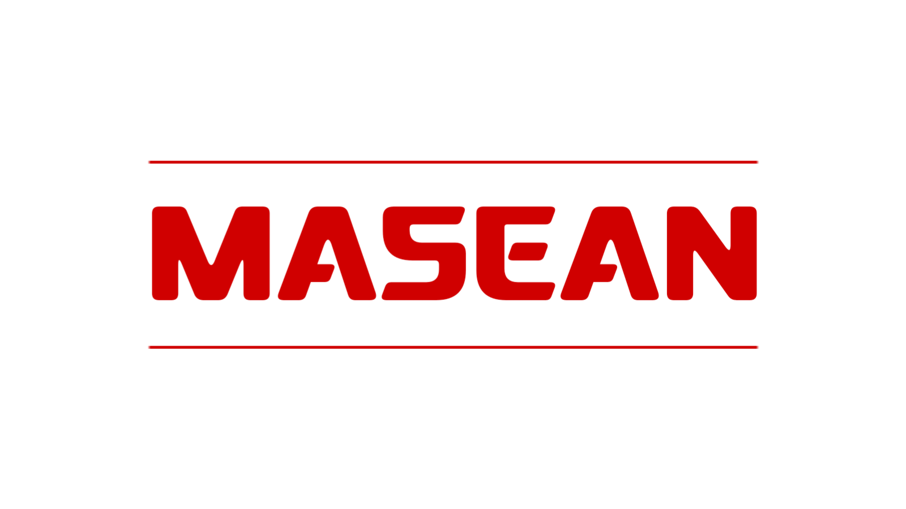
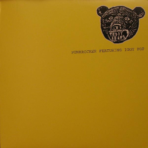
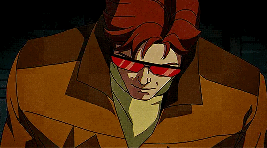

Student · Indonesia

Making things that make me happy or calm

---

## About

I'm Dean, a student who likes exploring a lot of different things rather than sticking to one field.

I'm really into Formula 1, especially the cars, teams, circuits, and everything around racing. I also enjoy making stories and fictional worlds, including Frostline, a thriller story I've been developing.

I like game modding, experimenting with design, collecting figures and LEGO, and messing around with different creative projects. Sometimes I build apps or websites too, mostly for school, my CV, or because I have an idea I want to turn into something real.

I'm still figuring out what I want to focus on in the future. For now, I just want to keep making things and exploring whatever catches my interest.

---

## Interests

Formula 1 · Game Modding · LEGO · Marvel · Drawing · Storytelling

---

## Currently

- Learning UI Design
- Making Scheone
- Contuining Frostline
- Drawing

---

## Projects

### Scheone

A Formula 1 companion app featuring race schedules and other F1-related information.

### Quote of the Day

A simple app that displays a different quote each day.

### Frostline

A thriller story project about teenagers who discover something strange involving black snow and a mysterious place called Frostline.

---

## Status

Still figuring things out.

Trying different things, working on whatever interests me, and seeing where it takes me.

---

## Currently Listening

<table>
<tr>
<td width="100">

</td>

<td>

<b>Punkrocker</b> 
Song By Teddybears

 

<code>▶</code> ━━━━━━━━━●━━ <code>2:21 / 2:47</code>

 

</td>
</tr>
</table>

“Still finding my direction.”

